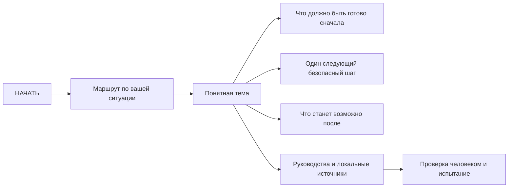

# НАЧАТЬ — автономная картотека знаний

> [!important] Это единственная начальная страница
> Выберите ситуацию ниже. Не начинайте с технических реестров, кодов или длинного перечня из тысяч карточек.

## Что вам нужно сейчас?

1. **Есть непосредственная опасность:** [[01 — КАРТОТЕКА ЗНАНИЙ/01 — Маршруты/01 — Если угроза прямо сейчас|перейти к выходу из опасности и связи с помощью]].
2. **Нужно подготовить семью на первые дни:** [[01 — КАРТОТЕКА ЗНАНИЙ/01 — Маршруты/02 — Маршрут на первые 72 часа|проверить людей, воду, еду, лекарства, жильё, связь и электричество]].
3. **Нужно прожить первый месяц:** [[01 — КАРТОТЕКА ЗНАНИЙ/01 — Маршруты/03 — Маршрут на первый месяц|перейти от аварийного запаса к устойчивому распорядку]].
4. **Нужна долгая автономность:** [[01 — КАРТОТЕКА ЗНАНИЙ/01 — Маршруты/04 — Маршрут долгой автономности|земледелие, ремонт, энергия, материалы и преемственность]].
5. **Нужны медицина и аптечки:** [[01 — КАРТОТЕКА ЗНАНИЙ/01 — Маршруты/05 — Маршрут медицины и аптечек|открыть медицинский маршрут]].
6. **Нужны еда, вода, семена, растения или грибы:** [[01 — КАРТОТЕКА ЗНАНИЙ/01 — Маршруты/06 — Маршрут еды, воды и семян|открыть пищевой и аграрный маршрут]].
7. **Нужны данные именно для Португалии:** [[01 — КАРТОТЕКА ЗНАНИЙ/01 — Маршруты/07 — Маршрут для Португалии|открыть локальный маршрут]].
8. **Нужно организовать одного человека или группу до семи:** [[01 — КАРТОТЕКА ЗНАНИЙ/01 — Маршруты/08 — Маршрут для одного человека и группы 1–7|открыть роли, связь, смены и решения]].
9. **Нужно заново поднимать ремёсла и технологии:** [[01 — КАРТОТЕКА ЗНАНИЙ/01 — Маршруты/09 — Маршрут восстановления технологий|идти от измерений и ручных инструментов к производству и образованию]].

## Вся картотека одним списком

- [[01 — КАРТОТЕКА ЗНАНИЙ/00 — Карта всех знаний|Карта всех областей, маршрутов и связей]]
- [[20 — Рабочие разделы/00 — Панели автономного кита|Что реально готово, что отсутствует и что нужно проверить]]
- [[10 — Руководства/00 — Путеводитель по руководствам|Полные обзорные руководства]]
- [[20 — Рабочие разделы/11 — Физический инвентарь|Что действительно имеется физически]]
- [[20 — Рабочие разделы/04 — Что ещё не готово|Очередь незакрытых задач]]
- [[01 — КАРТОТЕКА ЗНАНИЙ/03 — Карты связей/01 — Что нужно сначала.canvas|Понятная карта предпосылок со стрелками]]
- [[01 — КАРТОТЕКА ЗНАНИЙ/03 — Карты связей/04 — Образовательная лестница.canvas|Образование от дошкольного возраста до вуза]]
- [[40 — Стандарт картотеки/00 — Стандарт данных, тегов и связей|Единый стандарт данных, тегов и связей]]

## Как устроены связи

Обычный путь состоит максимум из трёх уровней: **НАЧАТЬ → маршрут → тема**. Технические идентификаторы, машинные реестры и доказательства находятся глубже и не являются основным способом чтения.

> [!note] Граф — это не меню
> Страницы «НАЧАТЬ», индексы, маршруты, панели и технические реестры исключены из глобального графа. В нём показываются только прямые смысловые зависимости между темами. Поэтому ссылка на индекс на этой странице работает как пункт меню, но не создаёт ложный «центр мира» в визуализации.

## Какой объём знаний охватывает система

Картотека строится от простого поддержания жизни семьи до постепенного восстановления технологий:

- безопасность, первая помощь, лекарства и уход;
- вода, туалет, гигиена, отходы и пищевая безопасность;
- приготовление, хранение и сохранение продуктов;
- дикорастущие растения, лекарственные травы, грибы и опасные двойники;
- семенной фонд, почва, выращивание культур, животные и рыболовство;
- жильё, тепло, огонь, одежда и защита от погоды;
- ручные инструменты, измерения, ремонт и ремёсла;
- древесина, камень, глина, керамика, стекло, известь, металлы и совместимость материалов;
- транспорт, плоты, малые лодки, карты, навигация и связь;
- механика, электричество, энергия и безопасные промышленные границы;
- управление группой, право, обучение, архив и передача знаний;
- дошкольное развитие, школа 6–18 лет, инклюзия, оценивание, профессиональная и университетская подготовка;
- математика, естественные науки, инженерия и восстановление производственных цепочек.

## Честный статус

> [!warning] Карта знаний не равна готовой энциклопедии
> Сейчас существует широкий каталог тем, обзорные документы и часть локальных источников. Но большинство практических карточек ещё не написаны, не проверены специалистом и не испытаны. Физически подтверждённых запасов — **0**, выпущенных карточек действий — **0**. Страница с названием темы не доказывает, что действие уже можно выполнять.

Особенно это относится к медицине, неизвестным растениям и грибам, токсичной химии, топливам, высокому напряжению, огню, давлению и тяжёлым конструкциям. Для неизвестного гриба или растения правило простое: **не употреблять по фотографии, приложению или ответу искусственного интеллекта**.

Служебные данные и полные реестры

- [[80_DATA_REGISTERS/INDEX|Полные реестры как Markdown]]
- [[90_ADMIN/INDEX|Пересборка и проверка целостности]]

CSV используются только как машинный backend. Открывать их для обычной работы не нужно.

