# Карта всех знаний

[[00 — НАЧАТЬ|🏠 Главная кита]]

> [!warning] Честная граница
> Эта страница — карта знаний и следующих проверок. Она не доказывает наличие вещей, навыка, актуальность права, успешное испытание или разрешение выполнять опасную работу.

## Откройте, если

Вам нужен не ещё один список файлов, а кратчайший путь от текущей ситуации к нужной теме.

## Что реально есть

- В технологическом каталоге учтено **748** узлов.
- Открытых разрывов: **32**.
- Выпущено к практическому применению: **0** технологических узлов.
- Строк физического инвентаря с заполненным фактическим количеством: **0**.
- Конкретных будущих карточек в предметных разделах: **890**.
- Эти цифры описывают каталог и доказательства, а не обещание автономности.

## Сначала нужно

- выбрать ситуацию, а не техническую папку.
- считать файл, вещь, навык, испытание и человеческий выпуск разными ступенями.
- при непосредственной угрозе сначала выйти из опасности и обратиться в действующую официальную службу.

## Один следующий безопасный шаг

> [!todo] Следующее доказательство
> Выберите один из девяти маршрутов ниже. Не открывайте технический реестр, пока не понятно, какой результат нужен.

## Что станет возможно после

Вы попадёте на одну из понятных тем максимум за два перехода, а технические данные останутся в сворачиваемом блоке.

## Карта маршрутов и тем

```mermaid
flowchart TD
  K["КАРТОТЕКА ЗНАНИЙ"]
  R01["Если угроза прямо сейчас"]
  K --> R01
  R02["Маршрут на первые 72 часа"]
  K --> R02
  R03["Маршрут на первый месяц"]
  K --> R03
  R04["Маршрут долгой автономности"]
  K --> R04
  R05["Маршрут медицины и аптечек"]
  K --> R05
  R06["Маршрут еды, воды и семян"]
  K --> R06
  R07["Маршрут для Португалии"]
  K --> R07
  R08["Маршрут для одного человека и группы 1–7"]
  K --> R08
  R09["Маршрут восстановления технологий"]
  K --> R09
  T01["Безопасность и выход из опасности"]
  T02["Вода и водоснабжение"]
  T03["Туалет, гигиена и отходы"]
  T04["Жильё, тепло и пожар"]
  T05["Связь, карты и транспорт"]
  T06["Медицинская помощь и аптечки"]
  T07["Лекарства и непрерывность ухода"]
  T08["Запас пищи и рацион"]
  T09["Безопасное приготовление и хранение пищи"]
  T10["Семенной фонд, почва и выращивание"]
  T11["Дикорастущие растения и лекарственные травы"]
  T12["Грибы и опасные двойники"]
  T13["Рыболовство и водная пища"]
  T14["Плоты, лодки и береговая безопасность"]
  T15["Животные и ветеринарная помощь"]
  T16["Энергия и резервное питание"]
  T17["Топливо, тепло и безопасное хранение"]
  T18["Инструменты и мастерская"]
  T19["Измерения, единицы и эталоны"]
  T20["Материалы, строительство и чертежи"]
  T21["Одежда, обувь и текстиль"]
  T22["Ремёсла и бытовой ремонт"]
  T23["Люди, роли, смены и решения"]
  T24["Португалия — службы, право и климат"]
  T25["Офлайн-знания, архив и обучение"]
  T26["Реальная готовность — имущество, навыки и испытания"]
  T27["Цепочка восстановления технологий"]
  T28["Охота, наблюдение и ненасильственная защита"]
  T29["Подготовка к зиме и зимний цикл"]
  T30["Раннее развитие и дошкольное образование"]
  T31["Школьное образование 6–18 лет, оценивание и инклюзия"]
  T32["Профессиональное и университетское образование"]
  R01 --> T01
  R01 --> T04
  R01 --> T05
  R01 --> T06
  R01 --> T24
  R02 --> T02
  R02 --> T03
  R02 --> T04
  R02 --> T08
  R02 --> T09
  R02 --> T16
  R02 --> T26
  R03 --> T21
  R03 --> T05
  R03 --> T07
  R03 --> T08
  R03 --> T17
  R03 --> T23
  R03 --> T26
  R04 --> T22
  R04 --> T29
  R04 --> T25
  R04 --> T27
  R04 --> T30
  R04 --> T31
  R04 --> T32
  R05 --> T02
  R05 --> T03
  R05 --> T06
  R05 --> T07
  R05 --> T23
  R05 --> T24
  R06 --> T02
  R06 --> T08
  R06 --> T09
  R06 --> T10
  R06 --> T11
  R06 --> T12
  R06 --> T15
  R07 --> T01
  R07 --> T05
  R07 --> T13
  R07 --> T14
  R07 --> T28
  R07 --> T29
  R07 --> T24
  R08 --> T06
  R08 --> T07
  R08 --> T23
  R08 --> T26
  R08 --> T30
  R08 --> T31
  R08 --> T32
  R09 --> T18
  R09 --> T19
  R09 --> T20
  R09 --> T27
  R09 --> T30
  R09 --> T31
  R09 --> T32
  classDef start fill:#1f6f54,color:#fff,stroke:#124b3a,stroke-width:2px
  classDef route fill:#dcefe7,color:#173d31,stroke:#4d8b72
  classDef topic fill:#f4f1e8,color:#332f26,stroke:#988f78
  class K start
  class R01,R02,R03,R04,R05,R06,R07,R08,R09 route
  class T01,T02,T03,T04,T05,T06,T07,T08,T09,T10,T11,T12,T13,T14,T15,T16,T17,T18,T19,T20,T21,T22,T23,T24,T25,T26,T27,T28,T29,T30,T31,T32 topic
```

## Обычное дерево ссылок

- [[01 — КАРТОТЕКА ЗНАНИЙ/01 — Маршруты/01 — Если угроза прямо сейчас|Если угроза прямо сейчас]]
  - [[01 — КАРТОТЕКА ЗНАНИЙ/02 — Темы/01 — Безопасность и выход из опасности|Безопасность и выход из опасности]]
  - [[01 — КАРТОТЕКА ЗНАНИЙ/02 — Темы/04 — Жильё, тепло и пожар|Жильё, тепло и пожар]]
  - [[01 — КАРТОТЕКА ЗНАНИЙ/02 — Темы/05 — Связь, карты и транспорт|Связь, карты и транспорт]]
  - [[01 — КАРТОТЕКА ЗНАНИЙ/02 — Темы/06 — Медицинская помощь и аптечки|Медицинская помощь и аптечки]]
  - [[01 — КАРТОТЕКА ЗНАНИЙ/02 — Темы/24 — Португалия — службы, право и климат|Португалия — службы, право и климат]]
- [[01 — КАРТОТЕКА ЗНАНИЙ/01 — Маршруты/02 — Маршрут на первые 72 часа|Маршрут на первые 72 часа]]
  - [[01 — КАРТОТЕКА ЗНАНИЙ/02 — Темы/02 — Вода и водоснабжение|Вода и водоснабжение]]
  - [[01 — КАРТОТЕКА ЗНАНИЙ/02 — Темы/03 — Туалет, гигиена и отходы|Туалет, гигиена и отходы]]
  - [[01 — КАРТОТЕКА ЗНАНИЙ/02 — Темы/04 — Жильё, тепло и пожар|Жильё, тепло и пожар]]
  - [[01 — КАРТОТЕКА ЗНАНИЙ/02 — Темы/08 — Запас пищи и рацион|Запас пищи и рацион]]
  - [[01 — КАРТОТЕКА ЗНАНИЙ/02 — Темы/09 — Безопасное приготовление и хранение пищи|Безопасное приготовление и хранение пищи]]
  - [[01 — КАРТОТЕКА ЗНАНИЙ/02 — Темы/16 — Энергия и резервное питание|Энергия и резервное питание]]
  - [[01 — КАРТОТЕКА ЗНАНИЙ/02 — Темы/26 — Реальная готовность — имущество, навыки и испытания|Реальная готовность — имущество, навыки и испытания]]
- [[01 — КАРТОТЕКА ЗНАНИЙ/01 — Маршруты/03 — Маршрут на первый месяц|Маршрут на первый месяц]]
  - [[01 — КАРТОТЕКА ЗНАНИЙ/02 — Темы/21 — Одежда, обувь и текстиль|Одежда, обувь и текстиль]]
  - [[01 — КАРТОТЕКА ЗНАНИЙ/02 — Темы/05 — Связь, карты и транспорт|Связь, карты и транспорт]]
  - [[01 — КАРТОТЕКА ЗНАНИЙ/02 — Темы/07 — Лекарства и непрерывность ухода|Лекарства и непрерывность ухода]]
  - [[01 — КАРТОТЕКА ЗНАНИЙ/02 — Темы/08 — Запас пищи и рацион|Запас пищи и рацион]]
  - [[01 — КАРТОТЕКА ЗНАНИЙ/02 — Темы/17 — Топливо, тепло и безопасное хранение|Топливо, тепло и безопасное хранение]]
  - [[01 — КАРТОТЕКА ЗНАНИЙ/02 — Темы/23 — Люди, роли, смены и решения|Люди, роли, смены и решения]]
  - [[01 — КАРТОТЕКА ЗНАНИЙ/02 — Темы/26 — Реальная готовность — имущество, навыки и испытания|Реальная готовность — имущество, навыки и испытания]]
- [[01 — КАРТОТЕКА ЗНАНИЙ/01 — Маршруты/04 — Маршрут долгой автономности|Маршрут долгой автономности]]
  - [[01 — КАРТОТЕКА ЗНАНИЙ/02 — Темы/22 — Ремёсла и бытовой ремонт|Ремёсла и бытовой ремонт]]
  - [[01 — КАРТОТЕКА ЗНАНИЙ/02 — Темы/29 — Подготовка к зиме и зимний цикл|Подготовка к зиме и зимний цикл]]
  - [[01 — КАРТОТЕКА ЗНАНИЙ/02 — Темы/25 — Офлайн-знания, архив и обучение|Офлайн-знания, архив и обучение]]
  - [[01 — КАРТОТЕКА ЗНАНИЙ/02 — Темы/27 — Цепочка восстановления технологий|Цепочка восстановления технологий]]
  - [[01 — КАРТОТЕКА ЗНАНИЙ/02 — Темы/30 — Раннее развитие и дошкольное образование|Раннее развитие и дошкольное образование]]
  - [[01 — КАРТОТЕКА ЗНАНИЙ/02 — Темы/31 — Школьное образование 6–18 лет, оценивание и инклюзия|Школьное образование 6–18 лет, оценивание и инклюзия]]
  - [[01 — КАРТОТЕКА ЗНАНИЙ/02 — Темы/32 — Профессиональное и университетское образование|Профессиональное и университетское образование]]
- [[01 — КАРТОТЕКА ЗНАНИЙ/01 — Маршруты/05 — Маршрут медицины и аптечек|Маршрут медицины и аптечек]]
  - [[01 — КАРТОТЕКА ЗНАНИЙ/02 — Темы/02 — Вода и водоснабжение|Вода и водоснабжение]]
  - [[01 — КАРТОТЕКА ЗНАНИЙ/02 — Темы/03 — Туалет, гигиена и отходы|Туалет, гигиена и отходы]]
  - [[01 — КАРТОТЕКА ЗНАНИЙ/02 — Темы/06 — Медицинская помощь и аптечки|Медицинская помощь и аптечки]]
  - [[01 — КАРТОТЕКА ЗНАНИЙ/02 — Темы/07 — Лекарства и непрерывность ухода|Лекарства и непрерывность ухода]]
  - [[01 — КАРТОТЕКА ЗНАНИЙ/02 — Темы/23 — Люди, роли, смены и решения|Люди, роли, смены и решения]]
  - [[01 — КАРТОТЕКА ЗНАНИЙ/02 — Темы/24 — Португалия — службы, право и климат|Португалия — службы, право и климат]]
- [[01 — КАРТОТЕКА ЗНАНИЙ/01 — Маршруты/06 — Маршрут еды, воды и семян|Маршрут еды, воды и семян]]
  - [[01 — КАРТОТЕКА ЗНАНИЙ/02 — Темы/02 — Вода и водоснабжение|Вода и водоснабжение]]
  - [[01 — КАРТОТЕКА ЗНАНИЙ/02 — Темы/08 — Запас пищи и рацион|Запас пищи и рацион]]
  - [[01 — КАРТОТЕКА ЗНАНИЙ/02 — Темы/09 — Безопасное приготовление и хранение пищи|Безопасное приготовление и хранение пищи]]
  - [[01 — КАРТОТЕКА ЗНАНИЙ/02 — Темы/10 — Семенной фонд, почва и выращивание|Семенной фонд, почва и выращивание]]
  - [[01 — КАРТОТЕКА ЗНАНИЙ/02 — Темы/11 — Дикорастущие растения и лекарственные травы|Дикорастущие растения и лекарственные травы]]
  - [[01 — КАРТОТЕКА ЗНАНИЙ/02 — Темы/12 — Грибы и опасные двойники|Грибы и опасные двойники]]
  - [[01 — КАРТОТЕКА ЗНАНИЙ/02 — Темы/15 — Животные и ветеринарная помощь|Животные и ветеринарная помощь]]
- [[01 — КАРТОТЕКА ЗНАНИЙ/01 — Маршруты/07 — Маршрут для Португалии|Маршрут для Португалии]]
  - [[01 — КАРТОТЕКА ЗНАНИЙ/02 — Темы/01 — Безопасность и выход из опасности|Безопасность и выход из опасности]]
  - [[01 — КАРТОТЕКА ЗНАНИЙ/02 — Темы/05 — Связь, карты и транспорт|Связь, карты и транспорт]]
  - [[01 — КАРТОТЕКА ЗНАНИЙ/02 — Темы/13 — Рыболовство и водная пища|Рыболовство и водная пища]]
  - [[01 — КАРТОТЕКА ЗНАНИЙ/02 — Темы/14 — Плоты, лодки и береговая безопасность|Плоты, лодки и береговая безопасность]]
  - [[01 — КАРТОТЕКА ЗНАНИЙ/02 — Темы/28 — Охота, наблюдение и ненасильственная защита|Охота, наблюдение и ненасильственная защита]]
  - [[01 — КАРТОТЕКА ЗНАНИЙ/02 — Темы/29 — Подготовка к зиме и зимний цикл|Подготовка к зиме и зимний цикл]]
  - [[01 — КАРТОТЕКА ЗНАНИЙ/02 — Темы/24 — Португалия — службы, право и климат|Португалия — службы, право и климат]]
- [[01 — КАРТОТЕКА ЗНАНИЙ/01 — Маршруты/08 — Маршрут для одного человека и группы 1–7|Маршрут для одного человека и группы 1–7]]
  - [[01 — КАРТОТЕКА ЗНАНИЙ/02 — Темы/06 — Медицинская помощь и аптечки|Медицинская помощь и аптечки]]
  - [[01 — КАРТОТЕКА ЗНАНИЙ/02 — Темы/07 — Лекарства и непрерывность ухода|Лекарства и непрерывность ухода]]
  - [[01 — КАРТОТЕКА ЗНАНИЙ/02 — Темы/23 — Люди, роли, смены и решения|Люди, роли, смены и решения]]
  - [[01 — КАРТОТЕКА ЗНАНИЙ/02 — Темы/26 — Реальная готовность — имущество, навыки и испытания|Реальная готовность — имущество, навыки и испытания]]
  - [[01 — КАРТОТЕКА ЗНАНИЙ/02 — Темы/30 — Раннее развитие и дошкольное образование|Раннее развитие и дошкольное образование]]
  - [[01 — КАРТОТЕКА ЗНАНИЙ/02 — Темы/31 — Школьное образование 6–18 лет, оценивание и инклюзия|Школьное образование 6–18 лет, оценивание и инклюзия]]
  - [[01 — КАРТОТЕКА ЗНАНИЙ/02 — Темы/32 — Профессиональное и университетское образование|Профессиональное и университетское образование]]
- [[01 — КАРТОТЕКА ЗНАНИЙ/01 — Маршруты/09 — Маршрут восстановления технологий|Маршрут восстановления технологий]]
  - [[01 — КАРТОТЕКА ЗНАНИЙ/02 — Темы/18 — Инструменты и мастерская|Инструменты и мастерская]]
  - [[01 — КАРТОТЕКА ЗНАНИЙ/02 — Темы/19 — Измерения, единицы и эталоны|Измерения, единицы и эталоны]]
  - [[01 — КАРТОТЕКА ЗНАНИЙ/02 — Темы/20 — Материалы, строительство и чертежи|Материалы, строительство и чертежи]]
  - [[01 — КАРТОТЕКА ЗНАНИЙ/02 — Темы/27 — Цепочка восстановления технологий|Цепочка восстановления технологий]]
  - [[01 — КАРТОТЕКА ЗНАНИЙ/02 — Темы/30 — Раннее развитие и дошкольное образование|Раннее развитие и дошкольное образование]]
  - [[01 — КАРТОТЕКА ЗНАНИЙ/02 — Темы/31 — Школьное образование 6–18 лет, оценивание и инклюзия|Школьное образование 6–18 лет, оценивание и инклюзия]]
  - [[01 — КАРТОТЕКА ЗНАНИЙ/02 — Темы/32 — Профессиональное и университетское образование|Профессиональное и университетское образование]]

Технические детали, статусы и источники

Этот блок нужен для аудита, а не как бытовая инструкция.

- **Домены backend:** `ANIMALS, BASE, CONSTRUCTION, EDUCATION, ENERGY, ENERGY_FUELS, FOOD_AGRI, GOVERNANCE, HAZARD, HEALTH, KNOWLEDGE, MAPS_COMMS, MATERIALS, PEOPLE_CARE, PORTUGAL, SECURITY, SHELTER, SYSTEM, TRANSPORT, WATER_WASH, WORKSHOP`.
- **Узлов в связанном срезе:** 734.
- **Узлов, выпущенных к практическому применению:** 0.
- **Открытых gap-записей в срезе:** 32.
- **Машинные источники:** `technology-dependency-register.csv`, `technology-dependency-edges.csv`, `known-gap-register.csv`, `technology-node-planning-register.csv`.
- **Опасные классы:** `S3/S4` — только границы, квалификация, право и источники; рецептур нет.

### Рабочие сводки

- [[20 — Рабочие разделы/01 — Что реально готово|Что реально готово]].
- [[20 — Рабочие разделы/04 — Что ещё не готово|Что ещё не готово]].
- [[20 — Рабочие разделы/11 — Физический инвентарь|Физический инвентарь]].

### Полные руководства

- [[10 — Руководства/24 — Мастер-статус каталога|Мастер-статус каталога]].
- [[10 — Руководства/22 — Аудит готовности к полной изоляции|Аудит готовности к полной изоляции]].

[[00 — НАЧАТЬ|← Главная кита]]
